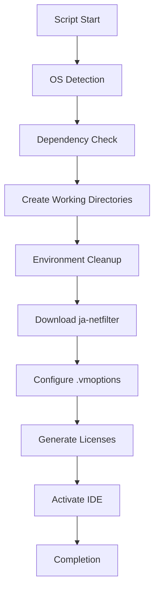
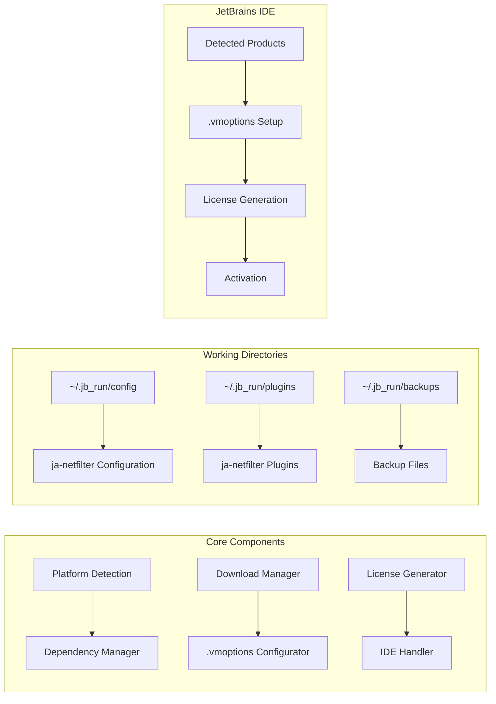
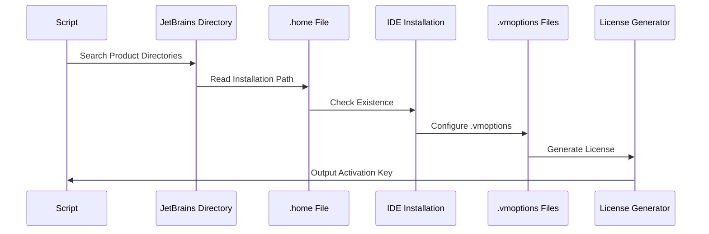

# 🇺🇸 ToolBox Activator (English)

### 🎯 Universal Activator for All JetBrains IDEs

**Automatic activation of all JetBrains IDEs using ja-netfilter**

[📖 Instructions](#-installation-and-usage-en) • [🔧 Features](#-features-en) • [💻 Supported IDEs](#-supported-ides-en) • [🛠️ How It Works](#-how-it-works-en)

---

```ascii
JJJJJJ   EEEEEEE   TTTTTTTT  BBBBBBB    RRRRRR    AAAAAA    IIIIIIII  NNNN   NN   SSSSSS
   JJ    EE           TT     BB    BB   RR   RR   AA  AA       II     NNNNN  NN  SS
   JJ    EE           TT     BB    BB   RR   RR   AA  AA       II     NN NNN NN   SS
   JJ    EEEEE        TT     BBBBBBB    RRRRRR    AAAAAA       II     NN  NNNNN    SSSSS
   JJ    EE           TT     BB    BB   RR   RR   AA  AA       II     NN   NNNN         SS
JJ JJ    EE           TT     BB    BB   RR   RR   AA  AA       II     NN    NNN          SS
 JJJJ    EEEEEEE      TT     BBBBBBB    RR   RR   AA  AA    IIIIIIII  NN    NNN    SSSSSS
```

## 📝 Description

ToolBox Activator is a powerful and convenient tool for automatically activating all installed JetBrains IDEs. The script works on Windows, macOS, and Linux, automatically detects installed products, downloads necessary ja-netfilter components, and generates license keys.

---

## ✨ Features

- 🚀 **Fast Activation** - Activates all installed JetBrains IDEs with one command
- 🔄 **Automatic Detection** - Finds all installed products automatically
- 🌐 **Cross-Platform** - Support for Windows, macOS, and Linux
- 📦 **Automatic Dependency Installation** - Installs curl and jq when necessary
- 🧹 **Environment Cleanup** - Removes traces of previous activators
- 💾 **Backup Creation** - Creates backups before changing configuration
- 🔧 **Flexible Configuration** - Ability to specify license name and expiration date
- 🛡️ **Security** - SHA-1 hash verification for downloaded files
- 🎯 **User-Friendly Interface** - Colored output and progress bars

---

## 💻 Supported IDEs

| IDE                  | Support              | Status  |
| -------------------- | -------------------- | ------- |
| 🎨 **IntelliJ IDEA** | Ultimate & Community | ✅ Full |
| ⚙️ **CLion**         | C/C++ IDE            | ✅ Full |
| 🐘 **PhpStorm**      | PHP IDE              | ✅ Full |
| 🎯 **GoLand**        | Go IDE               | ✅ Full |
| 🐍 **PyCharm**       | Python IDE           | ✅ Full |
| 🌐 **WebStorm**      | Web Frontend IDE     | ✅ Full |
| 🎮 **Rider**         | .NET IDE             | ✅ Full |
| 🗄️ **DataGrip**      | SQL IDE              | ✅ Full |
| 💎 **RubyMine**      | Ruby IDE             | ✅ Full |
| 🍎 **AppCode**       | iOS/macOS IDE        | ✅ Full |
| 🔮 **DataSpell**     | Data Science IDE     | ✅ Full |
| 🔍 **dotMemory**     | Memory Profiler      | ✅ Full |
| 🦀 **RustRover**     | Rust IDE             | ✅ Full |

---

## 🛠️ Installation and Usage

### 📋 Prerequisites

- **Windows**: PowerShell 5.1+
- **macOS**: Bash/Zsh
- **Linux**: Bash
- **Internet connection** for downloading files

### 🚀 Quick Start

#### Windows (PowerShell)

```powershell
# Download and run the script
Invoke-WebRequest -Uri "https://raw.githubusercontent.com/neKamita/toolbox-activator/main/activate.ps1" -OutFile "activate.ps1"
Set-ExecutionPolicy -ExecutionPolicy RemoteSigned -Scope Process
.\activate.ps1
```

#### macOS/Linux (Bash)

```bash
# Download and run the script
curl -o activate.sh https://raw.githubusercontent.com/neKamita/toolbox-activator/main/activate.sh
chmod +x activate.sh
./activate.sh
```

### 📝 Step-by-Step Instructions

1. **Download the script** for your OS
2. **Grant execution permissions** (for Linux/macOS):
   ```bash
   chmod +x activate.sh
   ```
3. **Run the script**:
   ```bash
   ./activate.sh  # Linux/macOS
   # or
   .\activate.ps1  # Windows
   ```
4. **Follow the console instructions**:
   - Enter license name (default: `ckey.run`)
   - Specify license expiration date (default: `2099-12-31`)
5. **Wait for completion** of activation for all products
6. **Copy the license keys** from the script output

---

## 🔧 How It Works

### Activation Process



### Script Architecture



### IDE Processing Flow



---

## 🖥️ Supported Platforms

| Platform       | Version       | Support    | Features            |
| -------------- | ------------- | ---------- | ------------------- |
| 🪟 **Windows** | 10/11         | ✅ Full    | PowerShell 5.1+     |
| 🪟 **Windows** | 8.1           | ✅ Partial | PowerShell 5.0      |
| 🍎 **macOS**   | Big Sur+      | ✅ Full    | Apple Silicon/Intel |
| 🍎 **macOS**   | Catalina      | ✅ Full    | Intel Processors    |
| 🐧 **Linux**   | Ubuntu 20.04+ | ✅ Full    | apt/dnf/yum/pacman  |
| 🐧 **Linux**   | Debian 11+    | ✅ Full    | apt Package Manager |
| 🐧 **Linux**   | Fedora 35+    | ✅ Full    | dnf/yum             |
| 🐧 **Linux**   | Arch Linux    | ✅ Full    | pacman              |

---

## 🚨 Important Notes

1. **Close all JetBrains IDEs** before running the script
2. **Save important projects** before activation
3. **Create backups** of important data
4. **Use at your own risk**
5. **The script activates ALL products**, regardless of previous activation

---

## ⚠️ Troubleshooting

### Common Issues and Solutions

#### 1. "Script won't run"

**Problem**: No execution permissions or execution policy

**Solution**:

```bash
# Linux/macOS
chmod +x activate.sh

# Windows PowerShell
Set-ExecutionPolicy -ExecutionPolicy RemoteSigned -Scope Process
```

#### 2. "No JetBrains IDEs found"

**Problem**: IDEs not installed or not detected

**Solution**:

- Ensure JetBrains IDEs are installed
- Check paths in `~/.config/JetBrains` (Linux/macOS) or `%APPDATA%\JetBrains` (Windows)
- Run IDE at least once to create configuration

#### 3. "File download error"

**Problem**: Network issues or server unavailability

**Solution**:

- Check internet connection
- Try running the script later
- Check availability of `https://ckey.run`

#### 4. "License keys don't work"

**Problem**: Incorrect keys or server blocking

**Solution**:

- Ensure you copied keys completely
- Check activation format in JetBrains IDE
- Try creating new license with different parameters

#### 5. ".vmoptions file error"

**Problem**: Permission issues or existing settings

**Solution**:

- Run script as administrator
- Check access permissions for .vmoptions files
- Script automatically creates backups

---

## 🔐 License and Security

### 📄 MIT License

This project is distributed under the MIT License. See the [LICENSE](LICENSE) file for details.

### 🛡️ Security

- **SHA-1 Verification** - All downloaded JAR files are verified for integrity
- **HTTPS Protocol** - All files are downloaded via secure connection
- **Local Processing** - License generation happens locally
- **Backup Creation** - All changes are saved in backups

### ⚠️ Warnings

- Use the script at your own risk
- Author is not responsible for possible consequences
- Recommended to use in test environment
- Possible license blocking by JetBrains

---

## 🤝 Contributing

We welcome contributions to the project! Here's how you can help:

### 📝 How to Contribute

1. **Fork the repository** 🍴
2. **Create a branch** for your feature: `git checkout -b feature/AmazingFeature`
3. **Commit your changes** 📦: `git commit -m 'Add some AmazingFeature'`
4. **Push to the branch** 🚀: `git push origin feature/AmazingFeature`
5. **Create a Pull Request** 📋

### 📋 PR Requirements

- Code must follow project standards
- Add tests for new functionality
- Update documentation if necessary
- Ensure all tests pass

### 🐛 Report a Bug

If you find a bug, please:

1. Check [existing issues](https://github.com/neKamita/toolbox-activator/issues)
2. Create a new issue with detailed description
3. Specify your OS, script version, and reproduction steps

---

## 🙏 Acknowledgments

- [ja-netfilter](https://gitee.com/ja-netfilter/ja-netfilter) - Core activation technology
- JetBrains - For amazing IDEs

---

<div align="center">

**⭐ If you like the project, give it a star!**

[](https://star-history.com/#neKamita/toolbox-activator&Date)

---

Made with ❤️ by [neKamita](https://github.com/neKamita)

</div>
